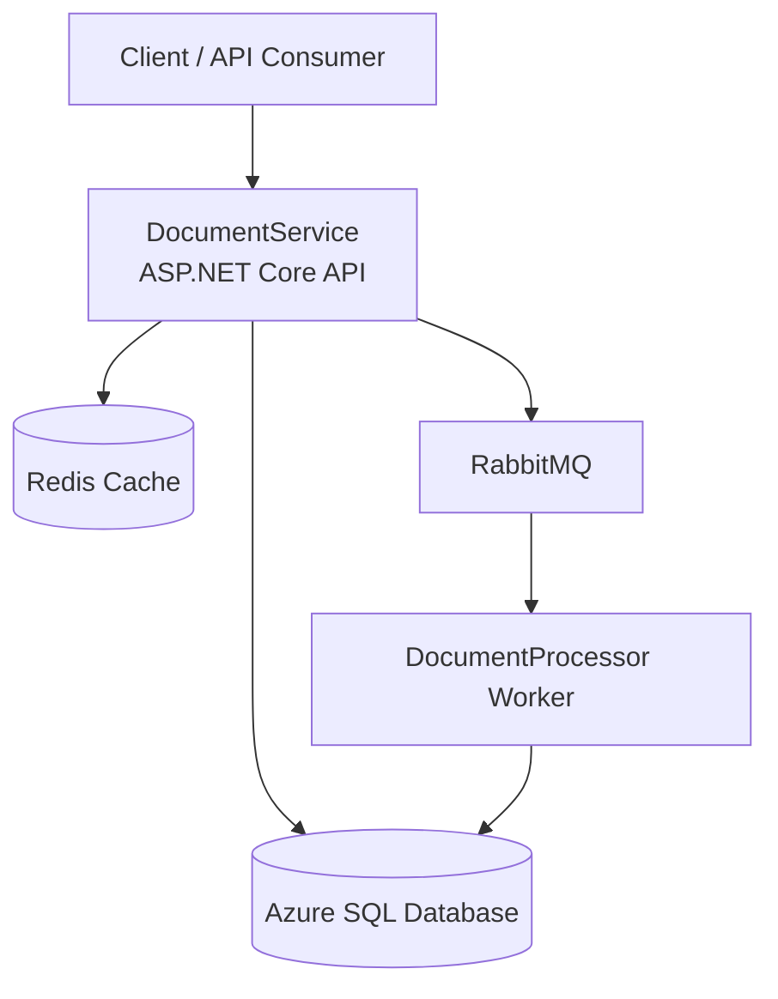

# 📄 DocumentProcessingPlatform

A **scalable, backend-focused document ingestion and processing platform** built using **ASP.NET Core**, designed to demonstrate **senior-level system design, async processing, and cloud-ready architecture**.

This project simulates real-world systems used in **banking, compliance, insurance, and enterprise platforms** where large volumes of documents must be processed reliably.

---

## 🎯 Project Goals

- Demonstrate **senior backend engineering skills**
- Design for **scalability, resilience, and failure handling**
- Apply **clean architecture and separation of concerns**
- Be **interview-ready** for Senior Software Engineer / Backend roles (₹18–25 LPA)

---

## 🧠 High-Level Overview

The platform allows users to:
1. Upload documents via REST APIs
2. Store metadata securely
3. Process documents asynchronously
4. Track processing status
5. Handle retries and failures safely

---

## 🏗️ System Architecture

```
            ┌──────────────┐
            │   Client     │
            │ (API Consumer│
            └──────┬───────┘
                   │
                   ▼
          ┌───────────────────┐
          │ DocumentService   │
          │ ASP.NET Core API  │
          └──────┬─────┬──────┘
                 │     │
    Metadata (SQL)│     │ Cache (Redis)
                 │     │
                 ▼     ▼
        ┌────────────┐ ┌────────────┐
        │  Database  │ │   Redis    │
        │ (Azure SQL │ │ (Cache)    │
        └────────────┘ └────────────┘
                 │
                 │ Publish Event
                 ▼
          ┌──────────────────┐
          │   RabbitMQ       │
          │  Message Broker  │
          └────────┬─────────┘
                   │
                   ▼
    ┌────────────────────────────┐
    │ DocumentProcessor.Worker   │
    │ Background Worker Service  │
    └────────┬──────────┬────────┘
             │          │
     Update Status   Write Logs
             │          │
             ▼          ▼
       Database     Processing Logs

```


## 🧱 Solution Structure
```
DocumentProcessingPlatform
│
├── DocumentService.Api
├── DocumentProcessor.Worker
├── DocumentProcessing.Shared
└── infrastructure
```


---

## 🔹 Module Overview

### 1️⃣ DocumentService.Api (API Layer)

**Purpose:**  
Handles client requests, validation, authentication, and publishing async events.

**Responsibilities:**
- Accept document uploads
- Validate inputs
- Store document metadata
- Publish processing events
- Expose status tracking APIs

**Key Concepts Demonstrated:**
- RESTful API design
- Middleware pipeline
- JWT authentication
- Idempotent endpoints
- Clean separation of concerns

**Internal Structure:**

---

### 2️⃣ DocumentProcessor.Worker (Background Processing)

**Purpose:**  
Processes documents asynchronously without blocking API requests.

**Responsibilities:**
- Consume messages from RabbitMQ
- Execute document processing steps (mocked)
- Handle retries and failures
- Update document status
- Write processing logs

**Key Concepts Demonstrated:**
- Message-based architecture
- Idempotent consumers
- Retry & DLQ strategy
- Failure isolation

---

### 3️⃣ DocumentProcessing.Shared (Shared Library)

**Purpose:**  
Avoid tight coupling between API and Worker while sharing common contracts.

**Contains:**
- Messaging contracts (events/commands)
- Cache abstractions
- Security helpers
- Common utilities

---

## 🗃️ Database Design

### Core Entities

- **Document**
- **DocumentProcessingLog**
- **AuditTrail**

**Design Focus:**
- Auditability
- Failure analysis
- Query efficiency

Indexes are applied on:
- `Document.Status`
- `Document.OwnerUserId`

---

## 🔐 Security

- JWT-based authentication
- Role-based authorization
- Secure configuration via environment variables
- API rate limiting

---

## ⚡ Performance & Scalability

- Async I/O throughout
- Redis cache (cache-aside pattern)
- Stateless APIs
- Queue-based load leveling
- Horizontal scaling ready

---

## 🧨 Failure Handling Strategy

- Retry with exponential backoff
- Dead Letter Queue (DLQ) for poison messages
- Partial failure recovery
- Graceful degradation when Redis or downstream services fail

---

## 🐳 Running the Project Locally

### Prerequisites
- .NET 7 or .NET 8
- Docker Desktop
- SQL Server / LocalDB

### Start Services
```bash
docker-compose up --build

